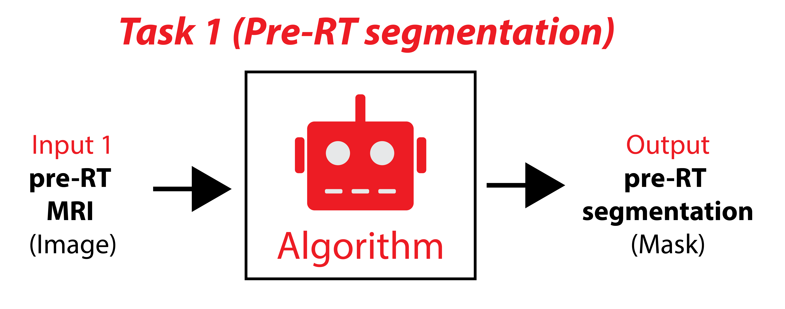
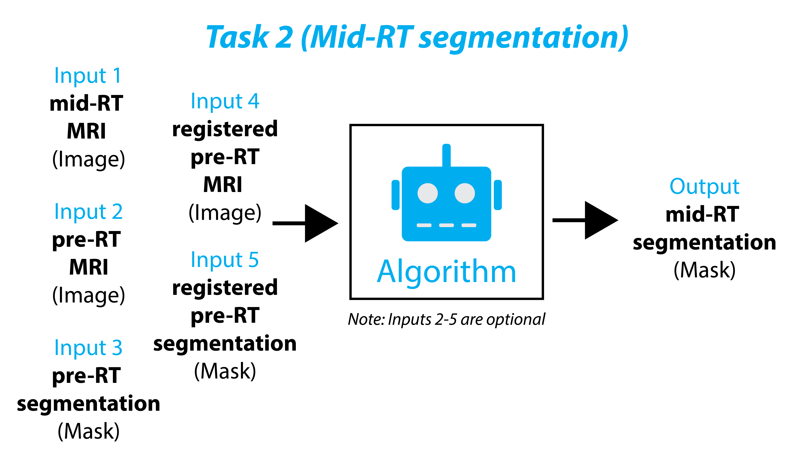
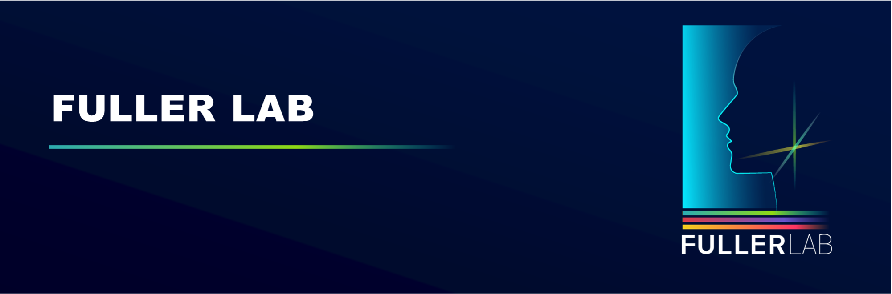

# HNTS-MRG 2024 Repo


Welcome to the GitHub repository for the Head and Neck Tumor Segmentation for MR-Guided Applications (HNTS-MRG) 2024 Challenge. This repository contains all the necessary scripts and documentation to participate in the challenge.

**General Contact Email:** <hntsmrg2024@gmail.com>.


## Overview 

The HNTS-MRG 2024 Challenge is aimed at developing and benchmarking algorithms for the segmentation of head and neck tumors in magnetic resonance images. The challenge is divided into two tasks:

**- Task 1: Pre-Radiotherapy Segmentation**



**- Task 2: Mid-Radiotherapy Segmentation**



Additional important information can be found on our [Grand Challenge website](https://hntsmrg24.grand-challenge.org/). The training data (n=150 patients) is available on [Zenodo](https://zenodo.org/records/11199559).

## Repository Structure

This repository contains 3 main subfolders (each which contain their own `README.md` files that provide further info):

- **Docker_tutorial/**: Includes comprehensive instructions and scripts to help participants package their algorithms into Docker containers for submission to grand-challenge.org.
- **Evaluation_example/**: Contains example code for calculating the DSCagg metric, which will be used to evaluate algorithms. Includes sample data for calculations.
- **Registration_example/**: Provides example code demonstrating how image registrations were performed, specifically from pre-RT to mid-RT registration. Includes sample data for registration.

## Installation

Use the following command to clone this repository to your local computer. 

```
git clone https://github.com/kwahid/HNTSMRG_2024.git
```

## Misc.

[Fuller lab Website: https://www.mdanderson.org/research/departments-labs-institutes/labs/fuller-laboratory.html](https://www.mdanderson.org/research/departments-labs-institutes/labs/fuller-laboratory.html). 


